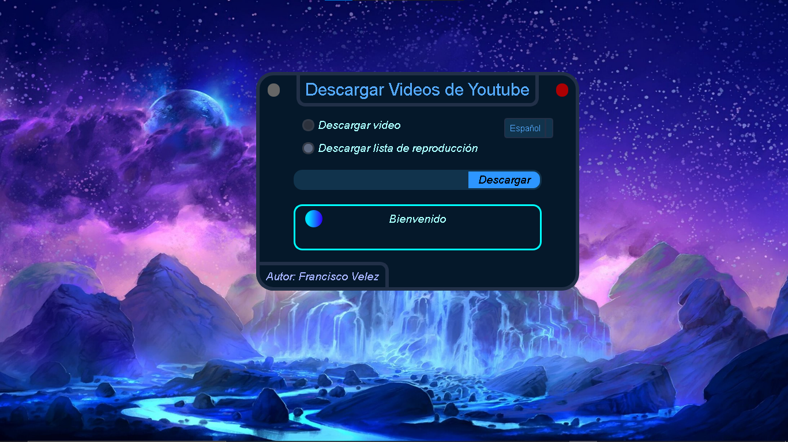

# App to download Youtube Videos

Project #2 with Python-PyQt5. Download videos from youtube.

## To use the code

1. Install requirements.txt to install the libraries with the version of each one used.

```
pip install -r requirements.txt
```

## Image of the graphical interface



## Manual

* **Red round button**: Closes the window.
* **Round gray button**: minimizes the window.
* **Download Options**: Videos or playlist.
* **Language**: to change the language, click where it says Spanish or, in this case, English.
* **Extra function**: double click on the window and drag to move the window.

<i>Best regard !!!</i>

**<cite>Author: Francisco Velez</cite>**
